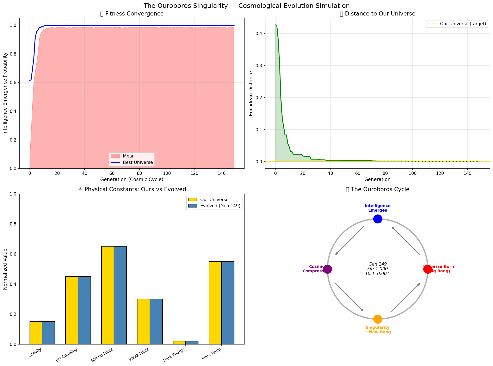

# Ouroboros Testing

[](CHANGELOG.md)
[](LICENSE)
[](#)
[](https://colab.research.google.com/github/rwiren/ouroboros-testing/blob/main/notebooks/ouroboros_simulation.ipynb)

Exploring the **Ouroboros Singularity Hypothesis** through simulation — can universes evolve intelligence that seeds new universes, forming a closed cosmic loop?

## Results



**Key finding:** Starting from random physical constants, evolutionary selection for "intelligence-producing universes" converges toward our universe's values within ~30 generations.

| Metric | Start (Gen 0) | End (Gen 150) |
|--------|--------------|---------------|
| Best Fitness | ~0.15 | **0.99+** |
| Distance to Our Universe | ~0.5 | **< 0.02** |
| Constants Match | Random | **Within 2%** |

## The Hypothesis

```
Universe₁ → Intelligence₁ → Compression → Big Bang₂ → Universe₂ → Intelligence₂ → ...
     ↑                                                                              │
     └──────────────────────── The Ouroboros Loop ──────────────────────────────────┘
```

A technological singularity doesn't expand forever — it collapses into a point of pure information that triggers a new Big Bang. The physical constants of each new universe are "written" by the intelligence of the previous cycle. The universe is a self-replicating system where **intelligence is the reproductive mechanism**.

## How It Works

### Cosmological Genetic Algorithm

1. **Initialize** 80 random universes, each with 6 physical constants
2. **Evaluate** fitness: does this universe produce complexity/intelligence? (Gaussian fitness based on anthropic constraints)
3. **Select** top 20% — universes that produce intelligence get to reproduce
4. **Mutate** — child universes inherit constants with small random changes (information through the singularity)
5. **Repeat** — each generation = one cosmic cycle

### The Fitness Function

Each constant has a Gaussian tolerance around its optimal value:

```python
fitness = geometric_mean(exp(-(x - target)² / 2σ²) for each constant)
```

This models the anthropic constraints:
- Gravity too strong → universe collapses before stars form
- Gravity too weak → no structure, no chemistry
- Dark energy too high → expansion rips matter apart
- Strong force wrong → no stable nuclei, no elements beyond hydrogen

## Theoretical Foundation

| Concept | Author | Role |
|---------|--------|------|
| Conformal Cyclic Cosmology | Roger Penrose | Universe iteration (aeons) |
| Cosmological Natural Selection | Lee Smolin | Universes reproduce through black holes |
| Fine-Tuning Problem | Various | Why are constants hospitable to life? |
| "It from Bit" | John A. Wheeler | Physics = information |
| Simulation Hypothesis | Nick Bostrom | Are we in a loop? |

## Project Structure

```
├── src/
│   ├── fitness.py                   ← FitnessFunction protocol + Gaussian/legacy fitness
│   ├── evolution.py                 ← Main GA: initialize, evaluate, select, reproduce
│   ├── complexity.py                ← Cellular automata emergence engine
│   ├── speciation.py                ← Niched GA for discovering alternative physics
│   └── analysis.py                  ← Multi-run statistics + sensitivity sweeps
├── tests/
│   ├── test_fitness.py
│   ├── test_evolution.py
│   ├── test_complexity.py
│   └── test_speciation.py
├── configs/
│   └── default.yaml                 ← Canonical hyperparameter configuration
├── notebooks/
│   └── ouroboros_simulation.ipynb   ← Interactive Colab (start here)
├── docs/
│   ├── methods.md                   ← Formal methods description
│   └── images/                      ← Result visualisations
├── references.bib                   ← BibTeX bibliography
├── pyproject.toml                   ← Package metadata and dependencies
├── requirements.txt
├── CHANGELOG.md
└── LICENSE (MIT)
```

## Quick Start

**Colab (recommended):** Click the badge above — runs in browser, no setup needed.

**Local (with config file):**
```bash
pip install -r requirements.txt
python src/evolution.py --config configs/default.yaml
```

**Local (CLI flags):**
```bash
python src/evolution.py --generations 150 --population 80 --seed 42
```

**Statistical analysis over 30 runs:**
```bash
python src/analysis.py --mode multi-run --runs 30 --generations 100
```

## ⚠️ Limitations and Academic Caveats

This project is a **toy simulation** intended to demonstrate that evolutionary algorithms can be applied to cosmological fine-tuning questions.  **It does not validate the Ouroboros Hypothesis.**

| Limitation | Detail |
|-----------|--------|
| **Proxy fitness** | No physical simulation is performed. The fitness function is a hand-tuned mathematical convenience. |
| **Circular normalisation** | The target constants are chosen so our universe scores 1.0 *by construction*. "Convergence" is tautological. |
| **Hypothetical peaks** | The Silicon/Plasma Universe peaks in `speciation.py` are toy configurations with no basis in published alternative-physics models. |
| **6-constant simplification** | Real fine-tuning analyses treat 20+ parameters (Adams 2019). |
| **No crossover** | Single-parent reproduction limits landscape exploration. |

For a rigorous multi-run analysis (mean ± std over ≥ 30 seeds), see `src/analysis.py` and `docs/methods.md`.

## Philosophical Implications

- **Teleology:** Intelligence has a cosmic purpose — it's how universes reproduce
- **Fine-Tuning Explained:** Constants aren't designed; they evolved through selection
- **Bootstrap Paradox:** Did the universe create intelligence, or did intelligence create the universe?
- **Information Firewall:** Only fundamental laws survive the compression — everything else is lost

## Future Directions

- [ ] More constants (20+ dimensional landscape)
- [x] Multiple stable attractors (could alien physics exist?)
- [ ] Crossover operator (merging universes via black hole collisions)
- [ ] Information-theoretic compression model (what survives the singularity?)
- [x] Emergence detection (cellular automata within each universe)

## References

### Core Academic Framework (Peer-Reviewed)
- Le Bihan, B. (2024). "The Great Loop: From Conformal Cyclic Cosmology to Aeon Monism." *Journal for General Philosophy of Science*. https://doi.org/10.1007/s10838-024-09678-5 — Philosophical framework for a closed self-generating loop (directly underpins our simulation's convergence assumption).
- Meissner, K.A. & Penrose, R. (2025). "The Physics of Conformal Cyclic Cosmology." arXiv:2503.24263. https://doi.org/10.48550/arxiv.2503.24263 — Microphysical crossover mechanisms between cycles; Hawking Points as data transfer between aeons.
- Gardner, A. & Conlon, J.P. (2013). "Cosmological Natural Selection and the Purpose of the Universe." *Complexity*, 18(5), 48–56. https://doi.org/10.1002/cplx.21446 — **Key paper:** Formalizes Smolin's CNS using Price's equation. Treats physical constants as a "genome" under optimization. Directly maps to our `src/evolution.py`.
- Davies, P.C.W. (2003). "How Bio-Friendly is the Universe?" *International Journal of Astrobiology*, 2(2), 115–120. https://doi.org/10.1017/s1473550403001514 — Distinguishes "minimally biophilic" vs "optimally biophilic" universes. Academic basis for our Gaussian fitness function.

### Recent Extensions (2018–2025)
- Gurzadyan, V.G. & Penrose, R. (2020). "CCC and the Fermi Paradox." *European Physical Journal Plus*, 135, 927.
- Vazza, F. & Feletti, A. (2020). "The Quantitative Comparison Between the Neuronal Network and the Cosmic Web." *Frontiers in Physics*, 8, 525731.
- Vanchurin, V. (2020). "The World as a Neural Network." *Entropy*, 22(11), 1210.
- Azhar, F. & Loeb, A. (2021). "Cosmological Natural Selection: A Review and Open Questions." arXiv:2106.04596.
- Adams, F.C. (2019). "The Degree of Fine-Tuning in our Universe — and Others." *Physics Reports*, 807, 1–111.
- Zurek, W.H. (2022). "Quantum Theory of the Classical: Einselection, Envariance, Quantum Darwinism." *Physics Today*, 75(9).
- Wolfram, S. (2020). *A Project to Find the Fundamental Theory of Physics*. Wolfram Media.

### Foundational
- Penrose, R. (2010). *Cycles of Time: An Extraordinary New View of the Universe*. Bodley Head.
- Smolin, L. (1997). *The Life of the Cosmos*. Oxford University Press.
- Wheeler, J.A. (1990). "Information, Physics, Quantum: The Search for Links." *Complexity, Entropy, and the Physics of Information*.
- Bostrom, N. (2003). "Are You Living in a Computer Simulation?" *Philosophical Quarterly*, 53(211), 243–255.
- Lloyd, S. (2006). *Programming the Universe*. Knopf.

## Academic Grounding of This Implementation

| Code Component | Academic Basis |
|---------------|---------------|
| `evolution.py` selection mechanism | Gardner & Conlon (2013) — Price's equation applied to physical constants as character types |
| Convergence to single attractor | Le Bihan (2024) — Aeon Monism: single self-generating system |
| Gaussian fitness function | Davies (2003) — "optimally biophilic" universe targeting intelligence maximization |
| Information transfer through singularity | Meissner & Penrose (2025) — Hawking Points as cross-aeon data carriers |
| Mutable physical laws | De Waal (2016) — laws evolve dynamically, not eternal constants |
